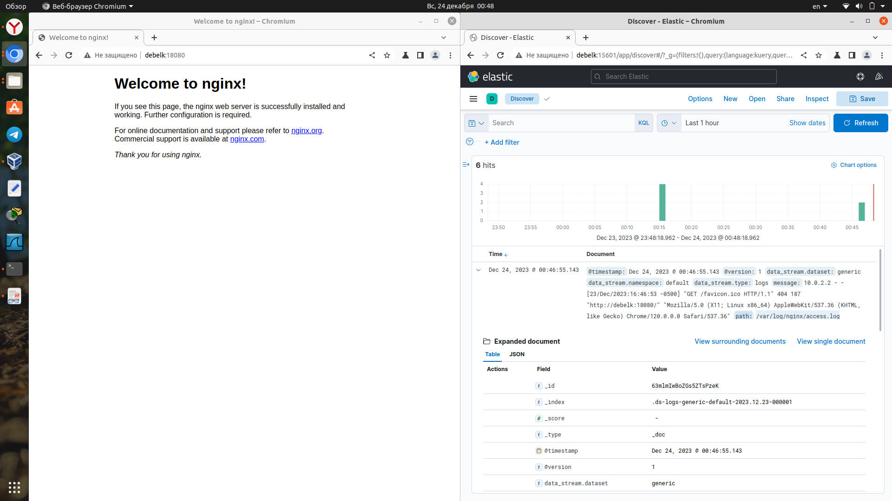
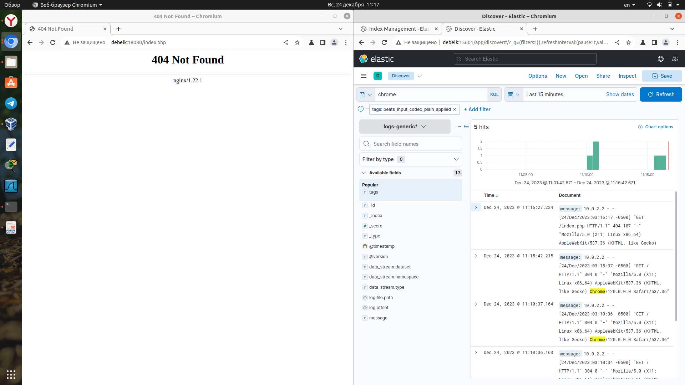

# Домашнее задание к занятию "`ELK`" - `Аблогин Павел`

---

### Задание 1

1. `Установил и запустил Elasticsearch`
2. `Изменил параметр cluster_name на my_elastic_cluster`

`Скриншот выполнения задания 1`

---

### Задание 2

1. `Установил и запустил Kibana`
2. `Сделал запрос в dev_tools kibana`

`Скриншот выполнения задания 2`

---

### Задание 3

1. `Установил и запустил Logstash и Nginx.`
2. `С помощью Logstash отправил access-лог Nginx в Elasticsearch.`

`Скриншот выполнения задания 3`

### Задание 4

1. `Установил и запустил Filebeat`
2. `Переключил доставку логов Nginx с Logstash на Filebeat`

`Скриншот выполнения задания 4`

---
## Дополнительные задания (со звездочкой*)

Эти задания дополнительные (не обязательные к выполнению) и никак не повлияют на получение вами зачета по этому домашнему заданию. Вы можете их выполнить, если хотите глубже и/или шире разобраться в материале.

### Задание 5

`Приведите ответ в свободной форме........`

1. `Заполните здесь этапы выполнения, если требуется ....`
2. `Заполните здесь этапы выполнения, если требуется ....`
3. `Заполните здесь этапы выполнения, если требуется ....`
4. `Заполните здесь этапы выполнения, если требуется ....`
5. `Заполните здесь этапы выполнения, если требуется ....`
6. 

`При необходимости прикрепитe сюда скриншоты
`
